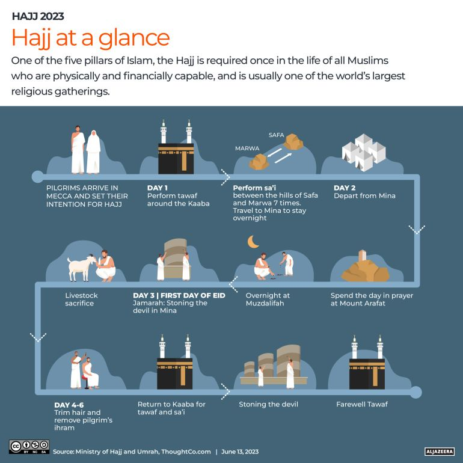

# Dokumentacioni i Aplikacionit të Haxhit

Ky dokument ofron informacion të detajuar rreth Aplikacionit të Haxhit, duke përfshirë funksionalitetet e tij, udhëzimet e instalimit dhe një udhëzues të ilustruar për ritualet e Haxhit.

## Përmbajtja

1.  [Përmbledhje Projekti](#përmbledhje-projekti)
2.  [Udhëzime Instalimi](#udhëzime-instalimi)
3.  [Udhëzues i Ritualeve të Haxhit](#udhëzues-i-ritualeve-të-haxhit)
    *   [Figura 1: Përmbledhje e Ritualeve të Haxhit](#figura-1-përmbledhje-e-ritualeve-të-haxhit)
    *   [Figura 2: Hapat e Detajuar të Haxhit](#figura-2-hapat-e-detajuar-të-haxhit)
    *   [Figura 3: Udhëzues i Thjeshtuar i Haxhit](#figura-3-udhëzues-i-thjeshtuar-i-haxhit)
    *   [Figura 4: Infografikë Udhëzuese e Haxhit](#figura-4-infografikë-udhëzuese-e-haxhit)
    *   [Figura 5: Hapat e Haxhit të Shpjeguar](#figura-5-hapat-e-haxhit-të-shpjeguar)
    *   [Figura 6: Hapat e Thjeshtuar të Haxhit](#figura-6-hapat-e-thjeshtuar-të-haxhit)

## Përmbledhje Projekti

Aplikacioni i Haxhit është një aplikacion Android i krijuar për të ofruar përdoruesve informacion dhe udhëzime të plota mbi kryerjen e pelegrinazhit të Haxhit. Ai përfshin rregulla, hapa dhe detaje të tjera thelbësore për të ndihmuar pelegrinët.

## Udhëzime Instalimi

Për të instaluar projektin, klononi depozitën dhe hapeni atë në Android Studio. Sigurohuni që të keni të instaluar SDK-të e nevojshme të Android dhe versionet e Gradle.

## Udhëzues i Ritualeve të Haxhit

Këtu është një udhëzues i ilustruar për ritualet e ndryshme të kryera gjatë Haxhit.

### Figura 1: Përmbledhje e Ritualeve të Haxhit

Kjo figurë ofron një përmbledhje të përgjithshme të ritualeve të Haxhit.

### Figura 2: Hapat e Detajuar të Haxhit

Kjo figurë ilustron hapat e detajuar të përfshirë në kryerjen e Haxhit.

### Figura 3: Udhëzues i Thjeshtuar i Haxhit

Kjo figurë ofron një udhëzues të thjeshtuar për pelegrinazhin e Haxhit.

### Figura 4: Infografikë Udhëzuese e Haxhit

Kjo infografikë ofron një udhëzues vizual për Haxhin.

### Figura 5: Hapat e Haxhit të Shpjeguar

Kjo figurë shpjegon hapat e Haxhit në detaje.

### Figura 6: Hapat e Thjeshtuar të Haxhit

Kjo figurë ofron një tjetër pamje të thjeshtuar të hapave të Haxhit.

